# How to set up experimentation in Azure App Configuration

Split Experimentation for Azure App Configuration is a feature that allows developers to easily run A/B tests for their applications and expand the monitoring phase of the DevOps loop to act on user feedback seamlessly. This experience is powered by the combined use of Azure App Configuration, Application Insights and Split Experimentation Workspace, to help you leverage your existing resources. To get started on your first experiment on Azure, follow these steps:

## Overview

•	Concept  
•	Prerequisites – Azure Subscription, Azure App Configuration store  
•	Step 1: Add Application Insights resource to App Configuration store  
•	Step 2: Create a Split Experimentation Workspace resource  
•	Step 3: Create a Variant Feature Flag and enable Telemetry  
•	Step 4: Create an application (Quickstart), make changes to application code  
•	Step 5: Setup an Experiment on App Configuration Portal  
•	Step 6: Getting Experiment results  
•	Additional: Access Control, ARM Template ; QuickStart: Sample App ; Troubleshooting  

## Concept

### What is Experimentation?
Microsoft has partnered with Split Software to deliver experimentation as a feature in Azure App Configuration. If this is your first time running an experiment, here are some terms to familiarize yourself with beforehand in the context of Feature Flags in App Configuration:
**Feature Flags:** Allow teams to **toggle features on or off** dynamically during runtime. The feature flag also has an associated code block. The feature flag's state triggers whether the code block runs. Read more about [Feature Flags on Azure App Configuration](https://learn.microsoft.com/en-us/azure/azure-app-configuration/concept-feature-management#basic-concepts). 
**Variant Feature Flags:** Represent different versions or configurations of a feature. In an experiment, the variant feature flags are compared in relevance to the metrics you are interested in and the traffic you have allocated for the application audience. Read more about [Variant Feature Flags on Azure App Configuration](https://github.com/microsoft/FeatureManagement-Dotnet/tree/release/v4?tab=readme-ov-file#variants).
**A/B Testing:** A/B testing, also known as split testing, is an industry-standard method for evaluating the impact of potential changes within a technology stack. Read more about [A/B Testing on Products](https://www.microsoft.com/en-us/research/group/experimentation-platform-exp/articles/a-b-testing-across-products/).

Consider the following example: you want to see if customers of your e-commerce website are more likely to click the checkout button on their shopping cart if it is yellow in color (variant A) or when the same checkout button is orange in color (variant B). To setup this comparison, you are likely to divide traffic by half to each variant of the feature flag and use number of clicks as a metric to measure which one is performing better (where better is defined by an increase in number of clicks on the checkout button). It is unlikely that all your features will be as simple to measure and immediately evaluate, and that is where experimentation comes in. Running an experiment involves setting up a timeline for this process of comparing the performance of each variant relevant to the metrics you are interested in. The terms ‘A/B testing’ and ‘experimentation’ are often used interchangeably, where experimentation is essentially an extended A/B test where you are systematically testing hypotheses. 

**Experimentation**: The process of systematically testing hypotheses or changes to improve user experience or software functionality. This definition also holds true for most scientific fields including technology, where all experiments have 4 common steps:
**1.	Developing a hypothesis** to document the purpose of this experiment,  
**2.	Outlining a method** of carrying out the experiment including setup, what will be measured and how,  
**3.	Observation** of the results measured by the metrics defined in the previous step,  
**4.	Drawing a conclusion** regarding whether the hypothesis was validated or invalidated. 

All A/B tests are experiments, but not all experiments are A/B tests, essentially implying that in the digital world, an A/B test is the simplest form of an experiment. Experimentation encompasses various controlled tests, including A/B testing, and can include more types of tests such as multivariate tests that include in-depth statistical analysis and more complex combinations of variant feature flags. 

In this tutorial where you will be generating a quote of the day to different users and checking their likes, our hypothesis is that users are more likely to click on the heart/like icon if the quote of the day is accompanied by a special message (“*hope this makes your day*”). Therefore, our metric of measure would be number of clicks on the heart icon (or Likes) and comparing between the two variants: one where the user sees the special message, one where the user does not. In this scenario, the two variations of the feature are true and false. This makes our experiment an A/B test. However, if we were testing multiple combinations of multiple variants such as adding multiple like buttons or changing colors of the special message as well, then it would be a Multivariate test. It is important for you to identify what kind of experiment you want to run so that the results can help you improve your application be it for performance or business. 

### Setting goals for your experiment
Before starting, consider the following in your hypothesis discovery stage: 
What should you run an experiment on? Why? Where do you even start? What problem are you trying to solve by running an experiment? What are some strategies to follow according to your business needs? Will this experiment help you make immediate improvements to the performance of your application or to your business? 

Now that you have identified what you hope to achieve by running an experiment on your application, you have to document your methodology: how will you run this experiment? What are some metrics you are interested in? What events of user or system interaction will you use to capture data to fuel these metrics for measure? As your experiment plan starts getting implemented: this is where the tutorial below goes. Your goal at this **methodology definition stage** is to make sure you are setting up your application code and resources to capture the correct data you are interested in.

When your experiment duration is nearing completion, it’s time to seek results. Observe and analyze the data and outcome to subsequently determine successes and failures, insights into user behavior, and learnings. Your goal at this stage is to make sure the data captured in all the resources you’ve deployed on Azure are passing validations: that you are indeed receiving the data that you had set up your resources to. If there are discrepancies, this is where you can edit your variant feature flags and view a different version of the same on-going experiment. 

**Drawing a conclusion** (or multiple conclusions if needed) is the final stage of your experimentation cycle. Learnings and outcomes that you can immediately implement into production go here. However, experimentation is a continuous process. Begin new experiments to continuously improve your product. 

### Understanding your experimentation results
Your experiment is only as good as the data your App Insights resource has collected. Once there is enough traffic to your application and subsequently more data from user interactions with events you have set up under the metrics mapping, you must determine which variant you intend to use as the control (baseline variant) and which one you intend to see changes in (comparison variant).  
 **Desired Outcome:** The desired outcome refers to the specific result or effect we hope to achieve through an experiment or intervention. It represents success according to our goals. 
 **Undesired Outcome:** An undesired outcome is the opposite of what we want to achieve. It represents failure or an unexpected result. 
 **Inconclusive:** An inconclusive result occurs when the data collected from an experiment does not provide clear evidence for either the desired or undesired outcome. 

It means that we can not confidently conclude whether the intervention had a significant impact.
Inconclusive results might arise due to insufficient sample size, noisy data, or other factors. 

Remember that experimentation involves analyzing data objectively and drawing meaningful conclusions based on evidence. Desired outcomes drive our efforts, undesired outcomes guide improvements, and inconclusive results prompt further investigation.

### How does experimentation work in Azure App Configuration?
 
To help introduce experimentation into your existing Azure resources, this new feature is an integrated offering by Split built on top of App Config and App Insights. As you go through this tutorial for setting up your first experiment, the key steps include setting up your App Config store including Variant Feature Flags, connecting your application to App Insights for definition of event data and metric mapping to be used for your experiment, and creating a Split Experimentation Workspace resource that will generate results powered by the Split SaaS on Azure.

### Data Access Control 
You use a Microsoft Entra Enterprise Application to manage the users and groups who can access the results of your experiment(s). If your group already uses an Enterprise Application, you may contact the administrator of your group to add you to the users of it. Otherwise, you can follow the instructions to create an Enterprise Application now or follow the instructions that will prompt you to create an Enterprise Application later. 

## Prerequisites 
•	An Azure subscription. If you don’t have one, [create one for free](https://azure.microsoft.com/en-us/free/). 
•	An App Configuration store. If you don’t have one, [create an App Configuration store](https://learn.microsoft.com/en-us/azure/azure-app-configuration/use-feature-flags-dotnet-core). 

## Steps

## Step 1: Add Application Insights resource to App Configuration store
Once you have created your App Configuration store, navigate to your deployed App Configuration store and select **Telemetry > Application Insights(preview)**. Select the Application Insights resource that you want to use as the data source of your experiments and click “Save”. A notification indicates that the Application Insights resource was updated successfully for the App Configuration store. If you don’t have an Application Insights resource already, create one for free by selecting “Create new”. 

## Step 2: Create a Split Experimentation Workspace resource
Once you have added your Application Insights resource to the App Configuration store, select **Experimentation > Split Experimentation Workspace (preview)** and click on "Create New" under the Split Experimentation Workspace label. This action opens a new panel with the following information to fill out. 

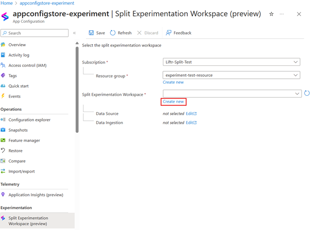

### Basics
**Subscription:** Select the Azure subscription that you want to use for the resource.
**Resource group:** Select an existing resource group or create a new one for the resource.
**Resource name:** Enter a unique name for the resource.
**Region:** Select the region where you want to deploy the resource.
**Pricing plan:** Currently only one pricing plan is supported (Pay As You Go).

Select “Next”.

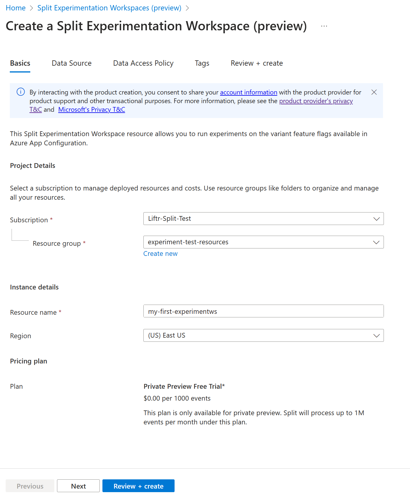

### Configure the Data Source
Enable Data Ingestion by selecting the checkbox to allow ingestion of impressions and events from the data source. If you deselect the checkbox, you can enable data ingestion later using the App Configuration portal by navigating to **Experimentation > Split Experimentation Workspace.**
Under Log Analytics workspace, select the Application Insights resource you want to use for this experiment (note: this has to be the same Application Insights Workspace that you connected to your App Configuration store in the previous step). 

Under **Export Destination Details**, select the Storage Account you want to use for storing impressions and events data. If you don’t have a Storage Account already, create one for free. A data export rule will be created in the selected Log Analytics workspace to export data to the storage account entered and configured below (note: when creating new Storage Account for Experimentation, you are required to use the same region as your Log Analytics Workspace).

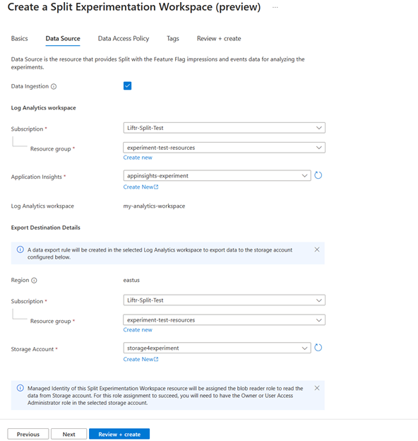
 
### Data Access Policy – Microsoft Entra ID 
Once the Data Source is entered, click on Next to select the Entra ID Application to use for authentication and authorization. If your group already uses a shared Enterprise Application, you may contact the administrator of your group to add you as a user. Otherwise, See detailed steps on how to create and setup your Entra ID application for Split Experimentation Workspace. Once you have completed your Entra ID setup, to be able to run the QuickStart app on this tutorial in Step 4, you have to add yourself as a user before running your app.

 
Select “Next” to review the information about your new resource and read the terms and select Create.

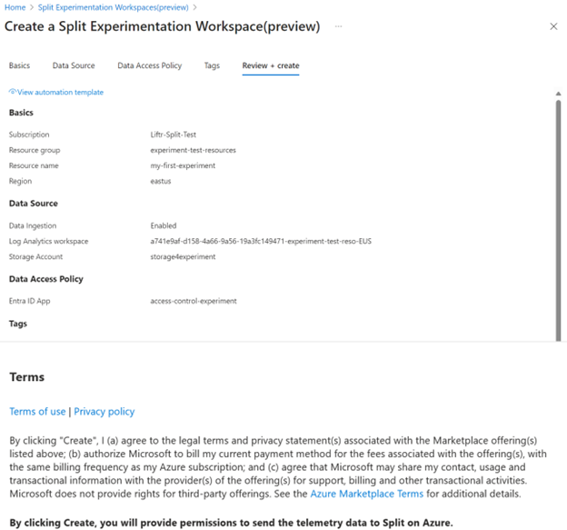
 
Now that you have created a Split Experimentation Workspace, add it to your App Configuration store. Back in your App Configuration store, under **Experimentation > Split Experimentation Workspace (preview)**, select the Split Experimentation Workspace you just created. You may need to click the refresh button to view your new Split Experimentation Workspace. Select Save.

## Step 3: Create a Variant Feature Flag and Enable Telemetry
The feature manager in the Azure portal for App Configuration provides a UI for creating and managing the feature flags and/or variant feature flags that you use in your applications. Variants enable a feature flag to become more than a simple on/off flag. A variant represents a value of a feature flag that can be a string, a number, a Boolean, or even a configuration object.

Once your App Configuration store has been updated with the Split Experimentation Workspace, go to **Operations > Feature manager > Create > Variant Feature Flag**.

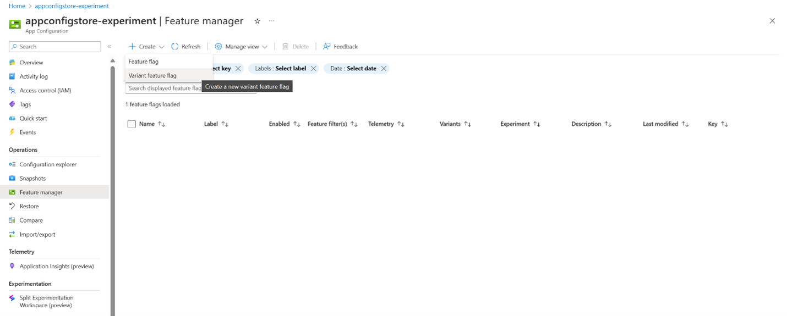
 
Fill out the Details form with the following information: 
**Enable feature flag:** Check this box. This enables the feature flag upon creation. 
Another option is to leave the box unchecked to save the new feature flag's configuration without enabling the feature flag, but you will not be able to run an experiment on a disabled feature flag.
**Name:** Enter a unique name for the new feature flag. The feature flag name is the unique ID of the flag, and the name that should be used when referencing the flag in code.   
*If you are using the QuickStart listed in Step 4, the name of this variant feature flag should be **“Greeting”**.*

**Key:** The variant feature flag's name is automatically suggested by App Configuration as the key value and is appended to the key string. The string starts with *appconfig.featureflag/*. Optionally replace the end of the string with a different key name.
**Labels:** Labels are used to differentiate key-values with the same key. Optionally add a label for your feature flag.
**Description:** Leave empty or enter a description for your variant feature flag, describing the flag.

 
Under Variants, fill out the form with the following information: 
**Variant name:** Enter a name for the new variant, alternatively rename the default variant name and value already listed for you on the portal which can be edited.
**Value:** Provide a value for the variant feature flag. Optionally select Edit value in multiline to edit the variant's value over several lines. Enter at least one more variant.
*If you are using the QuickStart listed in Step 4, the values should be “true” for Variant Name “On” and “false” for Variant Name “Off”. While the portal may already fill out part of it for you as an example, you can edit the fields.*

**Default variant:** select a default variant from the dropdown list. The default variant is the default fallback and baseline enabling targeted allocation to specific user groups for controlled testing and rollout. The word "Default" is displayed on screen next to the selected variant.
Select Next to access allocation settings. 

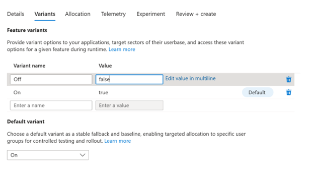
 
### Allocation: configure the variant feature flag audience
**Distribute traffic across variants:** Review your feature variants and allocate a percentage of the traffic across your variants, adding up to exactly 100%. 
**Assign percent of traffic eligible for the variant distribution:** Enter the proportion of traffic eligible for the variant distribution. Define a percentage of your total audience that will get the variation. The rest of the audience will get the default variant. 
**Allocation overrides:** Optionally select the options "Override by Groups" and "Override by Users" to enable variants for select groups or users. These options are disabled by default. You can assign variants to specific groups or users irrespective of the percentage allocation.

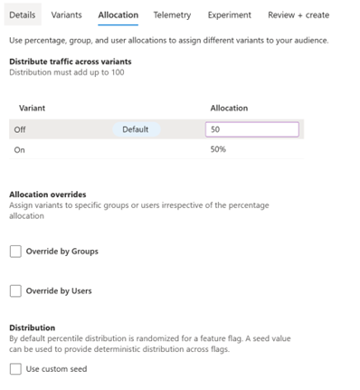
 
Click Next > to move on to the **Telemetry** tab. 
Check the **Enable Telemetry** box. When enabled, this will send the evaluation event for the variant feature flag to the telemetry publisher to be connected in your application code that you will create in the next step. Application Insights Telemetry Publisher package is available to publish the evaluation events to Application Insights, which is a necessary change to make in your application code in Step 4. If this box is unchecked, you cannot create your experiment.

 
Move on to the **Experiment** tab where you will be able to enable an experiment on this variant feature flag if your App Configuration store is successfully connected to your Split Experimentation Workspace resource already. Leave the checkbox unchecked (the box may not allow you to click on it at this stage).

You can create the experiment after you’ve created an application and after making changes to your application code to incorporate this variant feature flag and Application Insights Telemetry Publisher. 

Select “Review + Create” to finalize the creation of the variant feature flags. 

## Step 4: Create an application, make changes to application code
If you do not have a .NET application to run an experiment on already, use this Quickstart to create a Quote of the Day app. This QuickStart will walk you through the following steps:  creation of an application, connect it to your App Configuration store, connect it to your Application Insights resource, publish the evaluation events from your application code to Application Insights using the Application Insights Telemetry Publisher, define an ITargetingContextAccessor, add FeatureManagement with Targeting and Telemetry Publisher, add Telemetry Initializer and Middleware, grab the variant and emit an event you’d like to track.

If you already have a .NET application, the steps outlined in the QuickStart describe the changes you have to make to your existing code.

## Step 5: Setup an Experiment on App Configuration 

### Creating Metrics for your experiment

Metrics are quantitative measures that help evaluate the impact of feature flags on user behavior and outcomes. Metrics can be defined to count the occurrence of events, measure event values, or measure event properties. Metrics can be used to compare the performance of different treatments (variations) of a feature flag and assess the statistical significance of the results.
Navigate to your Split Experimentation Workspace resource. Under **Configuration > Experimentation Metrics**, click on “Create”.  

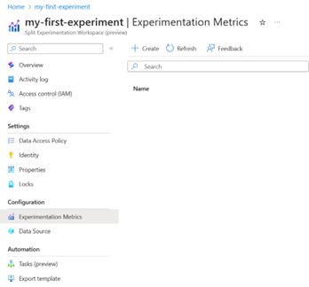

### Events and measuring metrics
A metric on Split Experimentation Workspace measures an event sent to Application Insights. Earlier in Step 4, you added “TrackEvent” to your application code, which is an event that represents user actions such as button selections. 

*In the QuickStart, the event we are tracking is when a user clicks on the heart-shaped like button, for which we entered “_telemetryClient.TrackEvent("Like")” where “Like” is the name of the telemetry event sent to Application Insights, which you will connect to the metric you are about to create using the blade that appears when you click “Create”. The QuickStart only specifies one event, but it is more likely that your application has multiple events that take in user actions.*

The event allows you to measure how many users are clicking on that button as an action, and creating a metric for an experiment means you are interested in collecting data on how users are interacting with the given action being tracked as an event and be able to derive results from that data. At this step, creating a metric requires you to specify how you want to measure the user action (i.e the Application Insights event), for which the “Application Insights event name” in the **Create an Experimentation Metric** form **must be the same as the event you specified in your application code in Step 4**.

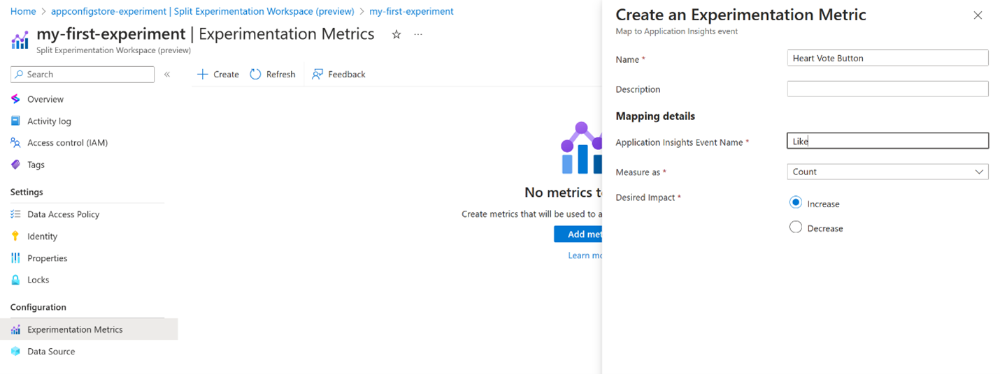
 
*If you are creating an application from scratch using the QuickStart listed in Step 4, at this stage, create a metric with “**Heart Vote Button**” as the metric name and enter “**Like**” as the Application Insights event name to match the event specified in the QuickStart application code. For this experiment, the tutorial is based on the hypothesis that more users click on the heart-shaped like button when there is a special message next to the Quote of the Day. The application code takes in this click as an event named Like. The application must send the Like event as telemetry to Application Insights and the **Desired Impact** for this experiment is to see an **Increase** in the number of user clicks (Measured as: **Count**) on the Heart Vote Button to be able to validate the given hypothesis. If there is a decrease in the number of clicks on the button despite the special message being shown to the allocated audience, then the hypothesis is invalidated for this experiment.*

**Name:** Enter a unique name for the new metric and a **Description** (optional)
**Application Insights event name:** For the metric to be mapped to an Application Insights event specified in your application code.
**Measure as:** Specify how to quantify this metric (e.g Count, Average, Sum, Percent)
 
**Count:** Counts the number of times the event is triggered by your users. 
**Average:** Averages the value of the event for your users. 
**Sum:** Adds up the values of the event for your users. Shows the average summed value. 
**Percent:** Calculates the percentage of users that triggered the event. 
While the Quickstart uses Count as the measure, your application may have events with user actions that are too large to be measured as Count, for which you may opt for any of the above measurements instead.  
**Desired Impact:** This allows results to be shown in context of positive and negative outcomes as it represents the ultimate goal or purpose behind measuring your created metric. 

Once you have created your metric, navigate to the Data Source blade and enable the **Data Ingestion checkbox** if it isn’t already enabled. Note: If you have not enabled **Data Ingestion** for your Split Experimentation Workspace resource already, feature evaluation and customer events will not be exported from your **Data Source** to Split.

Once the metrics have been created, return to the App Configuration portal and under **Experimentation > Split Experimentation Workspace**, confirm that your App Configuration store is connected to your Split Experimentation Workspace properly. If not, you can click Edit to update it.

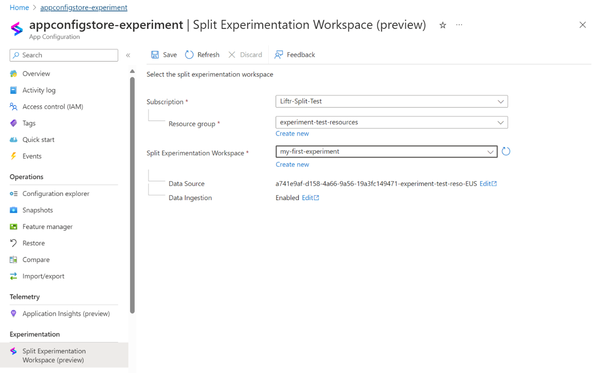

Once your App Configuration is connected to the Split Experimentation Workspace, go to Feature Manager and under “edit”, you can now create Experimentation on your previously created Variant Feature Flag.

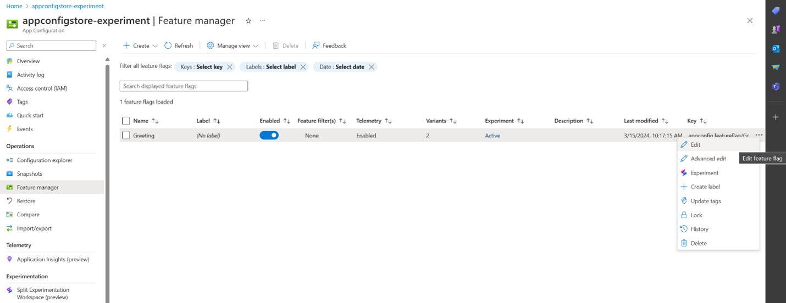
 
You will now be able to Create Experiment under the Experiment tab by checking the box and will be prompted to add a name and description for your experiment on this variant feature flag. 

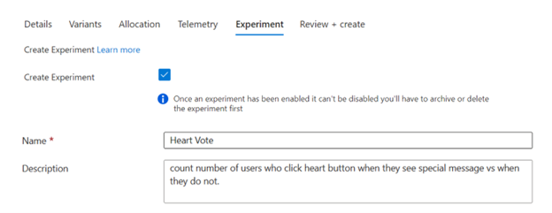
 
Click Review + update to activate the experiment. On **Feature Manager** in the App Configuration portal, your variant feature flag should now say **“Active”** under the experiment label.
 
## Step 6: Get Experiment Results
Now that you have experimentation enabled on the variant feature flag, your live application is ready to send data to be processed to generate impressions and results. To put your newly setup experiment to the test and generate results for you to analyze, simulate some traffic to your application and wait a few minutes.

To view the results of your experiment, navigate to **Feature Manager** and on the list of Feature Variants, click on **... > Experiment**, or alternatively, the Active link under the Experiment label in the grid view.

On the results page, select the version of the Experiment you would like to view (at this stage, there should be only one version), the Baseline you want to compare the results against, and the Comparison variant.

Once your application has generated enough traffic and event data (in this example, when the users click on the “Like” button after logging in), the more your experiment is likely to produce reliable results and conclusions. 

### Experiment Versions
If you navigate back to your **Feature Manager > Variant Feature Flag > edit** and make changes to: **Experiment title, Allocation,** or **Variant name/values**, then a new version of your experiment will be created for you to select to view the results of.

 
## Additional: 
[How to set up Data Access Control for Split Experimentation Workspace - authentication and authorization](how-to-setup-data-access-experimentation-app-config..md)
 ARM Template 
 QuickStart: Sample App - Quote of the Day
 Troubleshooting

